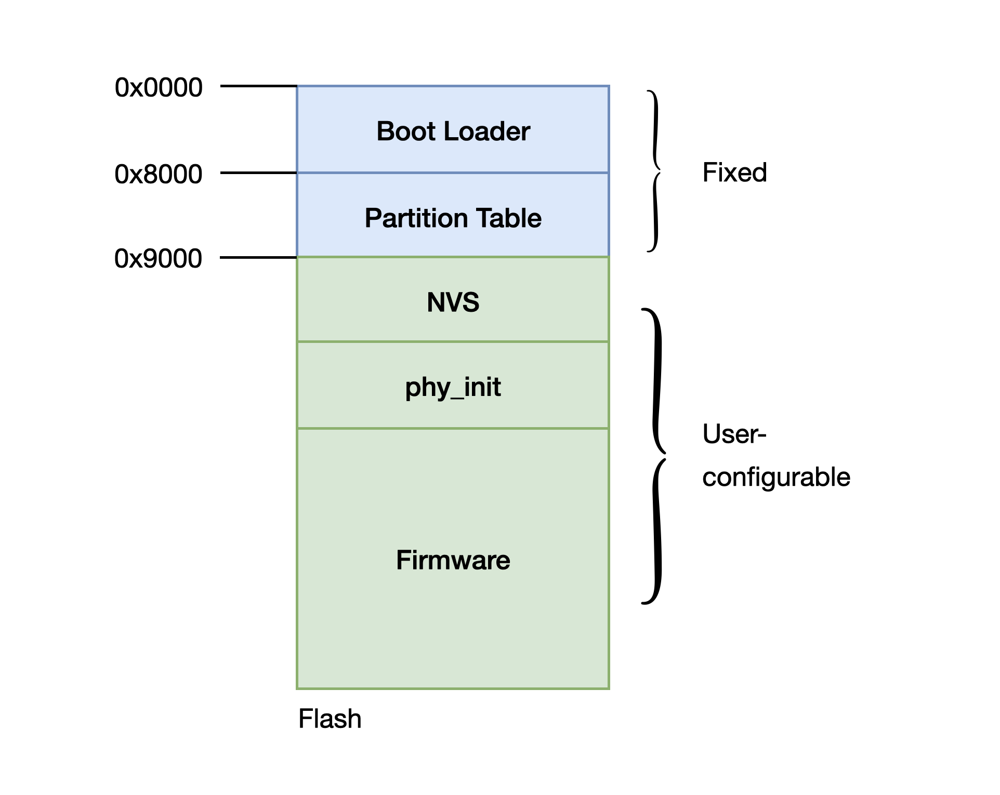
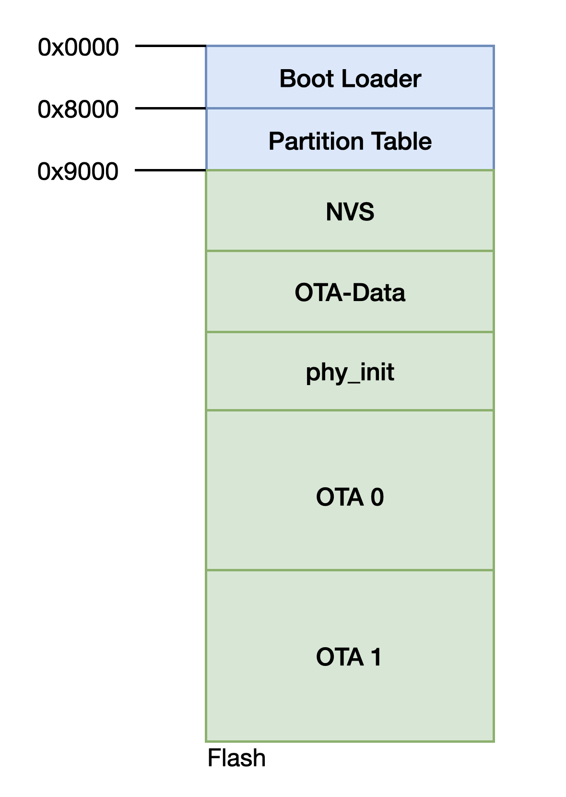
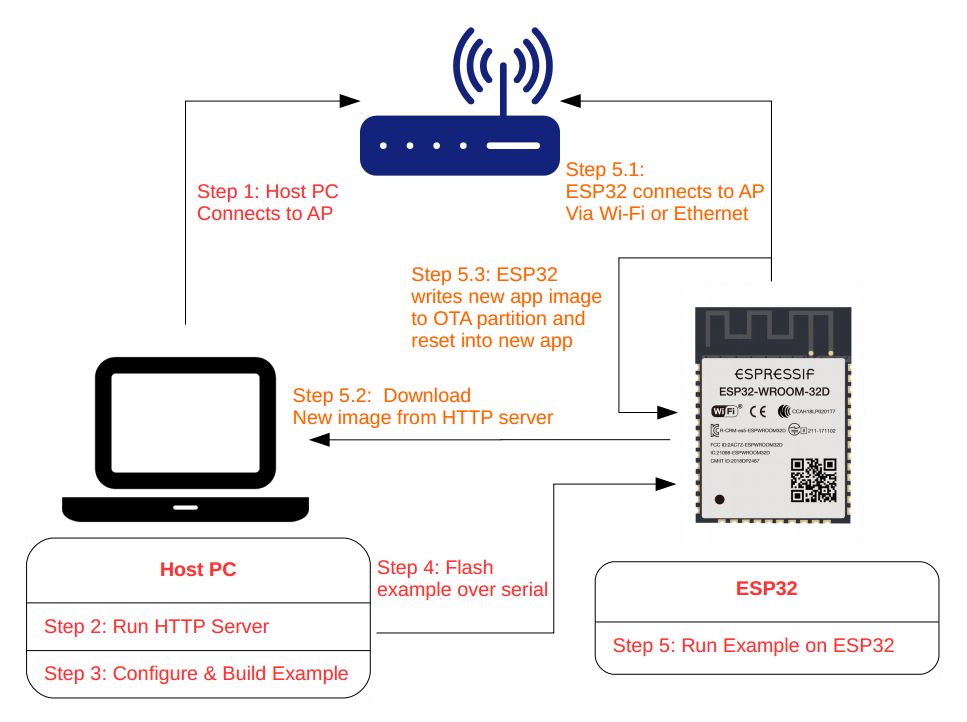

固件升级
=================

有时我们开发了新的功能，希望给已经在运行的设备进行固件升级。但很可能因为电路板已经被安装了外壳等原因而不能方便地使用下载器将新的固件烧录到设备，此时将需要使用 OTA (over-the-air) 升级功能。

本节将实现 ESP32 从指定的 URL 来更新固件的功能。如需查看相关代码，请前往 ``example/intelligentg-vehicle/components/OTA`` 目录。


Flash 分区
----------------

在讨论固件升级之前，让我们先了解一下 ESP32 中的 flash 分区。

在 ESP32 的应用中，通常包含多种不同类型的数据，因此通过分区表将 flash 划分为多个逻辑分区。具体结构如下：



​                                                                              Flash 分区结构


从上图可以看出，flash 地址在 0x9000 之前的结构是固定的，第一部分包括二级 Bootloader，后面紧接着就是分区表，分区表用来管理储存在 flash 剩余区域的数据分布。
关于分区表内容的详细信息可参见 分区表介绍<https://docs.espressif.com/projects/esp-idf/zh_CN/latest/esp32/api-guides/partition-tables.html>

## 创建分区表

使用 OTA 功能需要包含 OTA Data 分区和两个应用程序分区，可以通过创建一个分区表文件来实现，即 CSV 文件（Comma Separated Values，逗号分隔值）。

格式如下：

```
#Name,   Type, SubType, Offset,   Size, Flags

   nvs,      data, nvs,     ,        0x4000,
   otadata,  data, ota,     ,        0x2000,
   phy_init, data, phy,     ,        0x1000,
   ota_0,    app,  ota_0,   ,        1600K,
   ota_1,    app,  ota_1,   ,        1600K,
```

在这个分区表中，指定了两个 1600 KB 大小的应用程序分区，足够存放我们待升级的固件。



 																	  OTA Flash 分区

创建此分区文件后，我们还需在``menuconfig``中配置使用该自定义分区，而非默认分区。你可以在 ``Partition Table  ---> Partition Table`` 中选择 ``Custom partition table CSV``，同时在下面指定分区表文件名。

当然，也可以不用创建新的CSV文件，通过``menuconfig``中配置启用``CONFIG_PARTITION_TABLE_TWO_OTAmenuconfig``中的选项来选择预定义的分区表，该菜单支持三个应用程序分区：factory，OTA_0和OTA_1。


空中升级过程
----------------

空中升级使用两个应用程序分区交替工作的方式，确保不会因升级失败而无法启动设备，OTA Data 分区将记录哪个是活动分区。

OTA 固件升级过程中，状态变更如图所示：


   固件升级步骤

-  步骤 0：OTA_0 为活动固件，该信息储存在 OTA_Data 分区。

-  步骤 1：固件升级开始，识别并擦除非活动分区，新的固件将写入 OTA_1 分区。

-  步骤 2：固件写入完毕，开始进行验证。

-  步骤 3：固件升级成功，OTA_Data 分区已更新，并指示 OTA_1 现在是活动分区。下次启动时，固件将从此分区启动。 


代码
--------

现在我们来看一下实际执行固件升级的代码：

    esp_http_client_config_t config = {
         .url = url,
         .cert_pem = (char *)server_cert_pem_start,
         .event_handler = _http_event_handler,
      };
    
      esp_err_t ret = esp_https_ota(&config);
      if (ret == ESP_OK) {
         esp_restart();
      } else {
         ESP_LOGE(TAG, "Firmware upgrade failed");
      }
      return ret;

-  使用 ``esp_http_client_config_t`` 配置 OTA 升级源，包括升级地址的 URL，用于验证服务器的 CA 证书（升级从此服务器处获取）。 

-  然后执行 `esp_https_ota` API 启动固件升级，固件升级成功后将设备重启。


固件升级 URL

使用本示例之前需要配置一个 URL 链接，在 `menuconfig `中的 ``Intelligent Vehicle Configuration  ---> Example Configuration  ---> firmware upgrade url endpoint`` 进行配置。

示例中使用的是本地的 http server，所以这里的 IP 地址需改成用户PC端的 IP 地址。


演示
----------

本示例中的升级过程如下图所示：



​                                                                               OTA 升级过程

#### 运行 HTTPS Server

- 输入 ``cd https_server``，进入该文件夹。

- 执行命令：``openssl req -x509 -newkey rsa:2048 -keyout ca_key.pem -out ca_cert.pem -days 365 -nodes``，创建一个自签名的证书和 KEY，后续设置可参照 生成证书演示 <https://dl.espressif.com/dl/esp-idf/docs/_static/ota_self_signature.gif>

- 该步骤完成后会在当前目录下生成两个后缀为 `.pem` 的文件。

- 启动 HTTPS server，执行命令：``openssl s_server -WWW -key ca_key.pem -cert ca_cert.pem -port 8070``。

- 在这个文件夹下我们已经放了一个程序固件 `hello-world.bin`。你也可以替换成自己的固件，当然你需要去配置对应的 `firmware upgrade url endpoint`。

  

   **<u>如果有防火墙软件阻止对端口 *8070* 的访问，请将其配置为在运行本示例时允许访问。</u>**


   Windows 系统的用户来需要在 `openssl` 命令前加上 `winpty`。命令行如下所示：

   - ``winpty openssl req -x509 -newkey rsa:2048 -keyout ca_key.pem -out ca_cert.pem -days 365 -nodes``
   - ``winpty openssl s_server -WWW -key ca_key.pem -cert ca_cert.pem -port 8070``


#### 编译烧录固件

和以前一样的执行 ``make flash monitor`` 即可编译并烧录固件到开发板，同时打开串口监视器。
在编译时，会将我们前面生成的 ``ca_cert.pem`` 证书文件嵌入到最终的固件中。


执行固件升级


烧录固件后的开发板如果检测到flash中存有上次连接过的wifi信息，会进行自动配网；如果未发现wifi信息，将进行扫描二维码配网操作，摄像头会每隔200ms捕获一幅图像，当扫描到wifi二维码信息之后自动进行配网操作。只有在经过配网后才能进行 OTA 的操作，在配网后就可以通过短按按键来触发固件升级操作。升级成功将会自动重启运行升级后的固件。

在升级开始时，运行 HTTPS Server 的终端下将会出现如下信息：

    ACCEPT
    FILE:hello-world.bin

开发板在更新完成之后会自动重启，运行新的固件。


有了这个空中升级的功能，我们就可以方便的对设备进行升级。虽然这样有一个缺点是必须多空出一个固件大小的 flash 空间，不过它所带来的益处要更大。
