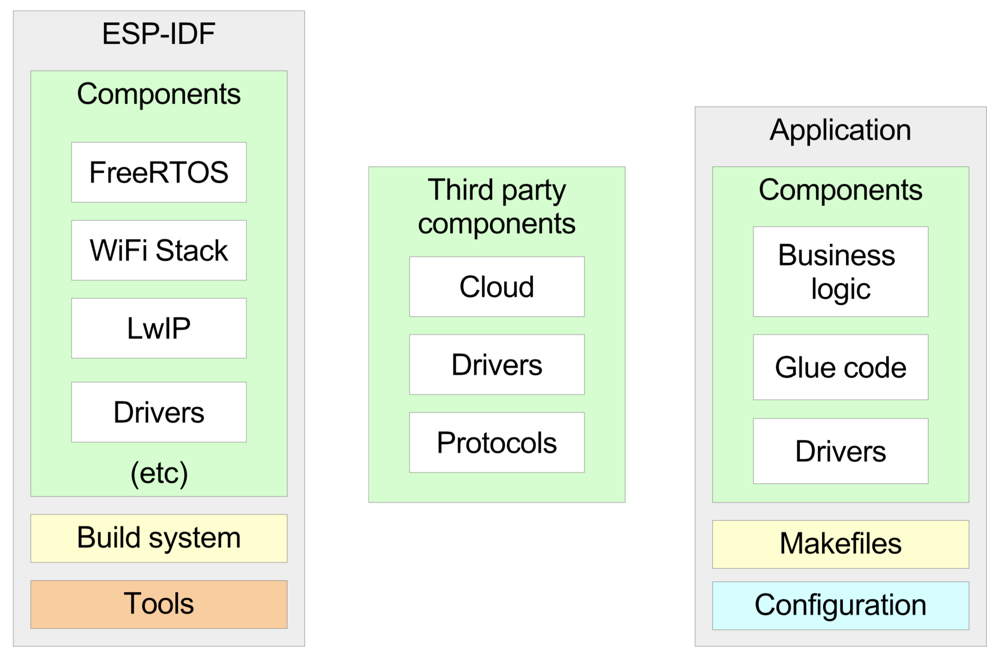
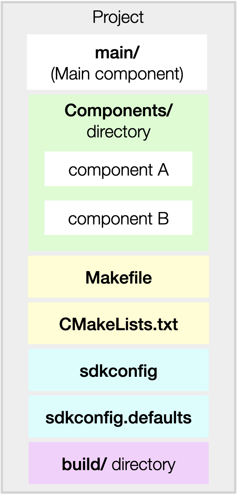

简介
============


ESP-Intelligent-Vehicle：ESP32 WIFI 智能小车
---------------------------------------------

ESP-Intelligent-Vehicle 是乐鑫推出的基于 ESP32 开发的wifi智能小车示例项目，内含产品开发的完整步骤、最佳做法，可实现摄像头扫描二维码配网、扫描二维码信息解析并上报、通过遥控器sbus协议或局域网内TCP通信对小车的移动控制、局域网内通过TCP通信发送命令控制小车进行物料搬运、小车定点寻路、视频同步、OTA等功能。本项目功能扩展方便，可用于教育领域。

    ESP-Intelligent-Vehicle

本项目中的智能小车有以下功能：

- 板载自动下载电路
- 支持解析二维码信息
- 支持扫描二维码配网
- 支持定点寻路
- 支持遥控器（sbus协议）控制
- 支持PC远程控制
- 支持视频同步
- 支持 OTA 升级


开发板介绍
-----------

本项目使用的是 ESP-WROVER-KIT-V4.1。


```txt
 ESP-WROVER-KIT-V4.1正面
```


```
ESP-WROVER-KIT-V4.1反面
```


入门指南
===============

在本章中，我们将介绍 ESP32 的开发环境，并帮助您了解 ESP32 可用的开发工具和代码仓库。

开发过程概述
--------------------

使用 ESP32 开发产品时，常用的开发环境如下图所示：


​                                                                                                    ESP32 产品开发过程

上图电脑（即开发主机）可以是 Linux、Windows 或 MacOS 操作系统。ESP32 开发板通过 USB 连接到开发主机，开发主机上有 ESP-IDF (乐鑫 SDK)、编译器工具链和项目代码。首先，主机编译代码生成可执行文件，然后电脑上的工具把生成的文件烧录到开发板上，开发版开始执行文件，最后你可以从主机查看日志。


准备工作
-------------

- ESP-WROVER-KIT-V3 开发板（也可以通过外接器件使用其他 ESP32 开发板）

- USB 数据线

- 用于开发的 PC（Windows、Linux 或 Mac OS）

  


ESP-IDF 介绍
-------------

ESP-IDF 是乐鑫为 ESP32 提供的物联网开发框架。

-  ESP-IDF (Espressif IoT Development Framework) 是由乐鑫官方推出的针对 ESP32 <https://www.espressif.com/en/products/hardware/socs>_ 系列芯片的开发框架。除此之外，乐鑫还有用于音频开发的 ESP-ADF 和用于 MESH 网络开发的 ESP-MDF 等各种开发框架，全部开放在 github <https://github.com/espressif>_ 上。
-  ESP-IDF 包含一系列库及头文件，提供了基于 ESP32 构建软件项目所需的核心组件，还提供了开发和量产过程中最常用的工具及功能，例如：构建、烧录、调试和测量等。
-  ESP-IDF 支持在 Windows、Mac、Linux 多种操作系统下编译，在 V4.0 版本上除了安装编译环境时的差异之外几乎无差别，编译、烧录的操作都是一致的。

### 设置 ESP-IDF

请参照 [ESP-IDF 入门指南](<https://docs.espressif.com/projects/esp-idf/zh_CN/release-v4.0/get-started/index.html>) ，按照步骤设置 ESP-IDF。注：请完成链接页面的所有步骤。

在进行下面步骤之前，请确认您已经正确设置了开发主机，并按照上面链接中的步骤构建了第一个应用程序。如果上面步骤已经完成，那让我们继续探索 ESP-IDF。

### ESP-IDF 详解

ESP-IDF 采用了一种基于组件的架构：

                


​                                                                                                                      ESP-IDF 组件设计

ESP-IDF 中的所有软件均以“组件”的形式提供，比如操作系统、网络协议栈、Wi-Fi 驱动程序、以及 HTTP 服务器等中间件等等。在这种基于“组件”的架构下，你可以轻松使用更多自己研发或第三方提供的组件。

### 工程目录结构


开发人员通常借助 ESP-IDF 构建 *应用程序*，包含业务逻辑、外设驱动程序和 SDK 配置。



​                                                                   应用程序架构

- `CMakeLists.txt` 和 `Makefile` 文件，用于控制工程的编译过程。
- `components` 文件夹，包含该项目的组件文件夹。
- `main` 文件夹，一个特殊的组件，默认编译这里面的代码，应用程序必须包含一个 **main** 组件。
- 一个可选的 *sdkconfig.defaults* 文件，存放应用程序默认的 SDK 配置。

在编译完成后会生成以下文件:

- `build` 文件夹，存放编译输出的文件。
- `sdkconfig` 文件，定义项目的所有配置。这个文件无需手动修改，编译时会自动从你在 menuconfig 中的设置来更新该文件。

> 更多关于工程结构和编译过程的细节，请参阅 [编程指南/构建系统](https://docs.espressif.com/projects/esp-idf/zh_CN/v4.0/api-guides/build-system.html#component-directories) 。


## ESP-IDF 环境搭建

请参照 [ESP-IDF 编程指南](https://docs.espressif.com/projects/esp-idf/zh_CN/latest/esp32s2/get-started/index.html)，按照步骤设置 ESP-IDF。

注意事项：

* 请完成链接页面的所有步骤。
* 请按照上面链接中的步骤构建一个或多个示例应用程序。

## ESP32 链接脚本修改

打开 ESP32的链接脚本模板 `${IDF_PATH}/components/esp32/ld/esp32.project.ld.in`，将以下代码添加到 `.flash.rodata` 段的末尾。

```
   /* Parameters and log system data */
    _param_start = .;
    KEEP(*(.param))
    KEEP(*(.param.*))
    _param_stop = .;
    . = ALIGN(4);
    _log_start = .;
    KEEP(*(.log))
    KEEP(*(.log.*))
    _log_stop = .;
    . = ALIGN(4);
```

以上代码可以实现将具有 `.param.*` 或 `.log.*` 段属性的变量，放置在连续的存储区域，从而加快变量遍历速度。