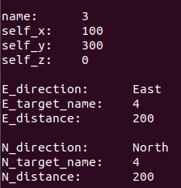

二维码配网
============

物联网时代技术开始规模化服务于民众，方便快捷显得尤为重要，WIFI 直连便是一个典型案例。

目前主流的 WIFI 配置模式有以下 3 种:

**1、智能硬件处于 AP 模式（类似路由器，组成局域网），手机用于 STA 模式**

手机连接到处于 AP 模式的智能硬件后组成局域网,手机发送需要连接路由的 SSID 及密码至智能硬件，智能硬件主动去连接指定路由后,完成配网

**2、一键配网(smartConfig)模式**

智能硬件处于混杂模式下,监听网络中的所有报文;手机 APP 将 SSID 和密码编码到 UDP 报文中,通过广播包或组播报发送,智能硬件接收到 UDP 报文后解码,得到正确的 SSID 和密码,然后主动连接指定 SSID 的路由完成连接。

**3、蓝牙配网**

智能硬件打开蓝牙与手机端的蓝牙配对，通过BLE通信将Wi-Fi的SSID和Password发送给智能硬件，智能硬件根据此信息进行配网。


这三种配网模式有利也有弊，但配网的核心操作无非是让智能硬件知道将要连接AP的SSID和密码，所以我们可以采取更直接的方式，让板载摄像头扫描二维码，解析出二维码中Wi-Fi的SSID和密码等信息之后进行配网。


## 流程

- 二维码配网是在**app_qifi_task**这一任务中完成的，任务起始阶段首先获取摄像头状态，如果摄像头状态不符合扫描二维码的需求，则删除本任务

```c
camera_config_t *camera_config = app_get_camera_cfg();
if (!camera_config) {
    vTaskDelete(NULL);
}
//quirc can support other frame size.(eg：FRAMESIZE_QVGA,FRAMESIZE_HQVGA,FRAMESIZE_QCIF,FRAMESIZE_QQVGA2,FRAMESIZE_QQVGA,etc)
if (camera_config->frame_size > FRAMESIZE_QVGA) {
    ESP_LOGE(TAG, "Camera Frame Size err %d, support maxsize is QVGA", (camera_config->frame_size));
    vTaskDelete(NULL);
}
```

- 随后创建一个空的结构体来存放即将要扫描到二维码的信息

```c
qr_recognizer = quirc_new();
```

- 之后进入while(1)循环中，使用switch case来根据不同状态选择不同的执行操作

>SKR_STATE_MIN:起始状态，将状态变为SKR_QR_SCANNING
>
>SKR_QR_SCANNING:核心操作，扫描二维码并解析
>
>SKR_QIFI_STRING_PARSE_FAIL:扫描二维码失败，将状态变为SKR_QR_SCANNING
>
>SKR_QIFI_STRING_PARSE_OK:进行配网操作
>
>SKR_WIFI_CONNECT_TIMEOUT：配网超时，将状态变为SKR_QR_SCANNING
>
>SKR_WIFI_GOT_IP：获取到IP地址，说明配网成功，释放储存二维码信息结构体的空间

app_qrcode_scan()函数在捕获一张图片之后调用identify.c和decode.c组件进行解析操作，将解析到的二维码信息存储在之前创建好的结构体中。

二维码是通过二进制信息存储消息，我们通过对这些二进制消息的处理已经得到关于该Wi-Fi二维码的一个标准字符串格式

```
"WIFI:T:WEP;S:mynetwork;P:mypass;H:true;"
```

T : Type（加密类型）

S : SSID（名称）

P : Password（密码）

H : HIDDEN（是否隐藏）

随后，我们还要通过字符串解析函数将该字符串中含有的加密类型、名称、密码、是否隐藏这些消息单独解析出来存放在一个结构体中供Wi-Fi连接调用。

```c
esp_err_t qifi_parser_parse(qifi_parser_t *parser, const char *buf, size_t buflen)
{
    qifi_field_t field = 0x0;
    const char *p = NULL;
    qifi_state_t state = qs_init;
    const char *bufend = buf + buflen;

    if ((buf == NULL) || (buflen > QIFI_STRING_MAX) || (buflen < QIFI_STRING_MIN) || (parser == NULL)) {
        return ESP_ERR_QIFI_INVLALID_ARGS;
    }

    // QiFi parse start
    for (p = buf; p < bufend; p++) {
        switch (state) {
        case qs_init:
            p = qifi_parser_state_qs_init(p, bufend, &field, &state);
            break;

        case qs_scheme_start:
            state = qs_dead;
            break;

        case qs_new_field_start:
            p = qifi_parser_state_qs_new_field(p, bufend, &field, &state, parser);
            break;

        default:
            state = qs_dead;
            break;
        }

        if (state == qs_dead) {
            break;
        }
    }

    ESP_LOGD(TAG, "field:0x%x", field);
    return qifi_parser_result(state, field);
}
```

详细代码请参考`components\QR-Code`以及调用的外部组件`components\qrcode-recognition`


# 二维码位置信息识别并上报

待进行TCP连接之后，系统所有任务开始运行，其中较为关键的就是二维码识别任务，该任务不断进行捕获图像扫描二维码，大概200ms捕获一次，捕获解析流程跟上文二维码扫描配网流程类似，待获得二维码中含有的字符串信息之后，通过QR-code-data()函数将该特定格式的字符串解析出单独的内容存放入QR_Code_Info_t结构体中。

```c
typedef struct {
    uint8_t name;     //Current location
    uint32_t self_x;  //Current point x coordinate
    uint32_t self_y;  //Current point y coordinate
    uint32_t self_z;  //Current point z coordinate

    struct {
        char E_direction;      //East
        uint8_t E_target_name; //East of target name
        uint32_t E_distance;   //East of target distance

        char S_direction;      //South
        uint8_t S_target_name; //South of target name
        uint32_t S_distance;   //South of target distance

        char W_direction;      //West
        uint8_t W_target_name; //West of target name
        uint32_t W_distance;   //West of target distance

        char N_direction;      //North
        uint8_t N_target_name; //North of target name
        uint32_t N_distance;   //North of target distance
    } target_t;
} QR_Code_Info_t;
```

```c
static void QR_code_data(const struct quirc_data *data)   
{
    QR_code_parser_init(&QR_dode_info);

    info = &QR_dode_info;       //上述结构体

    instr = data->payload;      //data->paylod为解析出二维码信息的字符串
    str = NULL;
    len = 0;

    if((!instr) || (!info)){
        ESP_LOGI("QR_code_data", "err");
    }

    str = parse_elem(instr, "/", &len);  //parse_elem()函数功能将拦截instr字符串中第二个参数之前的所有内容，并将instr向前移动
    info->name = atol(str)；             //atol()把字符串转换成长整型数
    instr = instr + len + strlen("/");   //instr指针向后偏移

    str = parse_elem(instr, "/", &len);
    info->self_x = atol(str);            //atol()把字符串转换成长整型数
    instr = instr + len + strlen("/");   //instr指针向后偏移

    str = parse_elem(instr, "/", &len);
    info->self_y = atol(str);            //atol()把字符串转换成长整型数
    instr = instr + len + strlen("/");   //instr指针向后偏移

    str = parse_elem(instr, "/", &len);
    info->self_z = atol(str);            //atol()把字符串转换成长整型数
    instr = instr + len + strlen("/");   //instr指针向后偏移

    while (instr){
        str = parse_elem(instr, ":", &len);
        switch (*str){
        case 'e':
            info->target_t.E_direction = *str;
            instr = instr + len + strlen(":");

            str = parse_elem(instr, ":", &len);
            info->target_t.E_target_name = atol(str);
            instr = instr + len + strlen(":");

            str = parse_elem(instr, "/", &len);
            if(!str){                          //检查字符串是否已经结束
                info->target_t.E_distance = atol(instr);
                instr = NULL;
            }else{
                info->target_t.E_distance = atol(str);
                instr = instr + len + strlen("/");
            }
            break;

	        ......
                
        default:
            break;
        }
    }
    app_set_QR_code_state(QR_QIFI_STRING_PARSE_OK); //改变状态 解析成功
}
```

具体QR-code-data()解析代码可以参考`components\QR-Code\user_qrcode_info.c`

待扫描二维码状态被设置为QR_QIFI_STRING_PARSE_OK，即说明解析成功，通过sprintf函数格式化字符串到一个字符串数组，通过socket连接发送给TCP Clinet

格式化字符串函数具体可参考`components\TCP\user_TCP.c`.

```c
if(QR_Code_Parse_OK_Flag == 1){
    len   = sprintf(QR_Info_buff,      "name:      %d\n", info->name);
    len += sprintf(QR_Info_buff + len, "self_x:    %d\n", info->self_x);
    len += sprintf(QR_Info_buff + len, "self_y:    %d\n", info->self_y);
    len += sprintf(QR_Info_buff + len, "self_z:    %d\n", info->self_z);
    len += sprintf(QR_Info_buff + len, "\n");

    if(info->target_t.E_target_name != 0){
        len += sprintf(QR_Info_buff + len, "E_direction:      %s\n", e);
        len += sprintf(QR_Info_buff + len, "E_target_name:    %d\n", info->target_t.E_target_name);
        len += sprintf(QR_Info_buff + len, "E_distance:       %d\n", info->target_t.E_distance);
        len += sprintf(QR_Info_buff + len, "\n");
    }
    if(info->target_t.S_target_name != 0){
        len += sprintf(QR_Info_buff + len, "S_direction:      %s\n", s);
        len += sprintf(QR_Info_buff + len, "S_target_name:    %d\n", info->target_t.S_target_name);
        len += sprintf(QR_Info_buff + len, "S_distance:       %d\n", info->target_t.S_distance);
        len += sprintf(QR_Info_buff + len, "\n");
    }
    if(info->target_t.W_target_name != 0){
        len += sprintf(QR_Info_buff + len, "W_direction:      %s\n", w);
        len += sprintf(QR_Info_buff + len, "W_target_name:    %d\n", info->target_t.W_target_name);
        len += sprintf(QR_Info_buff + len, "W_distance:       %d\n", info->target_t.W_distance);
        len += sprintf(QR_Info_buff + len, "\n");
    }
    if(info->target_t.N_target_name != 0){
        len += sprintf(QR_Info_buff + len, "N_direction:      %s\n", n);
        len += sprintf(QR_Info_buff + len, "N_target_name:    %d\n", info->target_t.N_target_name);
        len += sprintf(QR_Info_buff + len, "N_distance:       %d\n", info->target_t.N_distance);
        len += sprintf(QR_Info_buff + len, "\n");
    }
```


摄像头可以通过扫描如上格式的二维码信息并解析出单独信息通过TCP发送给客户端，下图为PC端TCP Client收到的消息



# 定点寻路

如果选择了PC control operation mode，系统还会控制底盘运动到解析出的目标位置，从而实现**定点寻路**。

例如上面的二维码信息显示4号点在距离目前小车位置的东面200、北面200，说明4号点在东北方向，相对目前小车位置坐标为200.200。

小车在识别到该信息以后便会直线运动到该坐标位置。

系统会根据一个方向数值来确定小车运动的大概方向，该方向数值会在解析出二维码时确定

|                 |         |                 |
| :-------------: | :-----: | :-------------: |
| 1+3=4(西北方向) | 1(北面) | 1+6=7(东北方向) |
|     3(西面)     |         |     6(东面)     |
| 2+3=5(西南方向) | 2(南面) | 2+6=8(东南方向) |

根据不同的方向、位置进行相应的解算，得到电机所要发送的电流正负和大小。

具体发送电流请参考[Remote_control.md](Remote_control.md)