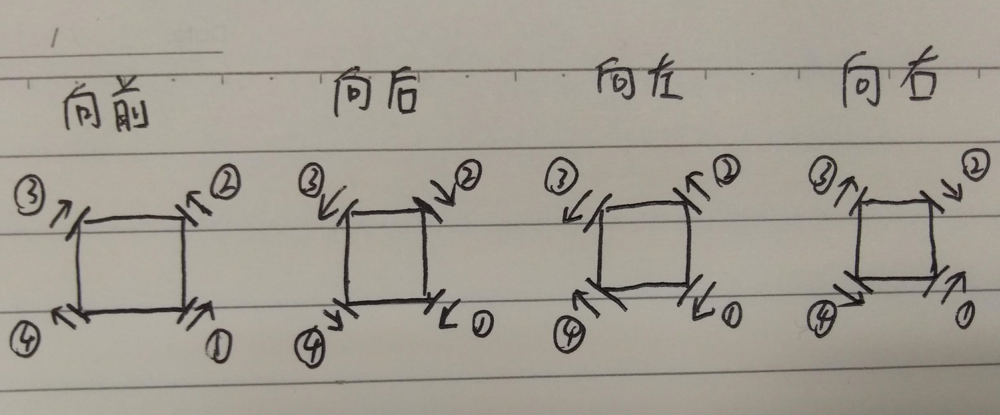
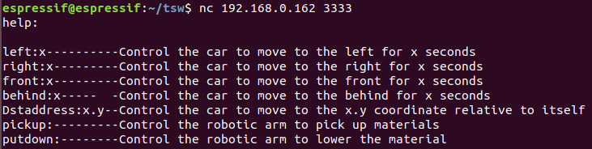

远程控制
============

本项目除了遥控器控制底盘移动、物料搬运之外，还可以通过TCP Client向开发板发送命令来进行控制

目前支持七种命令

>left:x           //小车向左运动x秒
>
>right:x        //小车向右运动x秒
>
>behind:x    //小车向右运动x秒
>
>front:x        //小车向右运动x秒
>
>Dstaddress:x.y  //小车直接移动至相对目标位置的x.y坐标
>
>pickup:       //物料搬运拾起动作
>
>putdown:   //物料搬运放下物料动作
>
>help：        //命令库概览

当然用户也可以修改Rev_Parse()API来增加自己的命令和控制

当开发板接收到TCP Client发送过来的命令时，会进行解析操作，

- 如果不是已有命令库中的命令，会提示用户“Invalid command”，
- 如果没有在命令后加冒号“：”，会提示用户"err format,please input ':' after an instruction"，
- 如果正确解析并成功执行，会返回给用户"Recieved！OK"

当命令通过Rev_Parse()API进行解析后，会通过任务通知值传递给Remote_Control_Task()，进而执行相应的控制操作

### Remote Control Task

```c
void Remote_Control_Task(void *arg)
{
    BaseType_t xResult;
    uint32_t ulValue;
    wayfinding.num = 0;
    wayfinding.next_target_name = 0;
    while (1)
    {
        xResult = xTaskNotifyWait(0x00000000, 0xFFFFFFFF, &ulValue, portMAX_DELAY);
        if (xResult == pdPASS)
        {
            switch (ulValue)
            {
            case BIT_right:
                Current_Action(Dst_info->E_Distance, 1, -1);
                break;

            case BIT_behind:
                Current_Action(Dst_info->S_Distance, -1, 1);
                break;

            case BIT_left:
                Current_Action(Dst_info->W_Distance, -1, -1);
                break;

            case BIT_front:
                Current_Action(Dst_info->N_Distance, 1, 1);
                break;

            case BIT_Dst:
                if(x > 0 && y > 0)
                    Oblique_Action(x, y, 1, -1, 1, 1);
                else if(x > 0 && y < 0)
                    Oblique_Action(x, -y, 1, -1, -1, 1);
                else if(x < 0 && y > 0)
                    Oblique_Action(-x, y, -1, -1, 1, 1);
                else if(x < 0 && y < 0)
                    Oblique_Action(-x, -y, -1, -1, -1, 1);
                break;

            case BIT_pickup:
                Pick_up_Action();
                break;

            case BIT_putdown:
                Put_down_Action();
                break;

            case BIT_QR:
                Automatic_wayfind_easy();
                break;

            default:
                break;
            }
        }
        vTaskDelay(1000 / portTICK_RATE_MS);
    }
}

```

其中BIT_right、BIT_behind、BIT_left、BIT_front、BIT_Dst、BIT_pickup、BIT_putdown、BIT_QR均是宏定义的通知值

```c
#define BIT_right       BIT_0
#define BIT_behind      BIT_1
#define BIT_left        BIT_2
#define BIT_front       BIT_3
#define BIT_Dst         BIT_4
#define BIT_pickup      BIT_5
#define BIT_putdown     BIT_6
#define BIT_QR          BIT_7
```

### 前后左右

前后左右的命令均是通过Current_Action() API 来进行控制操作

```c
/*
  *         |  sym1  |  sym2 |
  * front   |    1   |   1   | North
  * behind  |   -1   |   1   | Sorth
  * left    |   -1   |  -1   | West
  * right   |    1   |  -1   | East
  */
void Current_Action(uint32_t Times, int sym1, int sym2)
{
    uint32_t time_num = Times * 10;
    printf("\r\nsee it time_num:%d\r\n", time_num);
    for (int i = 0; i < time_num; i++)
    {
        C610_SendCurrentVal(sym1 * Val,
                            sym1 * sym2 * Val,
                            sym1 * -Val,
                            sym1 * sym2 * -Val);
        vTaskDelay(100 / portTICK_RATE_MS);
        printf("Send is OK:time_num:%d\n", i);
    }
    C610_SendCurrentVal(sym1 * Half_Val,
                        sym1 * sym2 * Half_Val,
                        sym1 * -Half_Val,
                        sym1 * sym2 * -Half_Val);
    vTaskDelay(100 / portTICK_RATE_MS);
    C610_SendCurrentVal(0, 0, 0, 0);
    vTaskDelay(1000 / portTICK_RATE_MS);
}
```

该函数传递的形参包括底盘要运动的时间，以及两个**特征值**，两个特征值通过不同的**正负组合**来控制相应电机的转向（给电机发送正值电流，电机正转，发送负值电流，电机反转），根据四轮全向轮运动原理，根据不同的电机速度方向组合可以实现前后左右运动。



| sym1 | sym2 | direction | direction |
| :--: | :--: | :-------: | :-------: |
|  1   |  1   |   Front   |   North   |
|  -1  |  1   |  Behind   |   Sorth   |
|  -1  |  -1  |   Left    |   West    |
|  1   |  -1  |   Right   |   East    |

通过C610_SendCurrentVal() API 发送四个电机对应的电流值，具体可参考[system.md](system.md)中的CAN驱动章节

### 相对目标位置

Dstaddress命令主要是通过Oblique_Action() API来进行控制操作，该控制命令将控制小车直接直线移动值相对坐标值x.y点

小车斜向运动的速度相当于x方向运动以及y方向运动速度的合成，如果x方向距离大于y方向距离，则将规定速度值赋给x方向速度，根据时间相同，路程越远速度越快的原则，通过正切解算出y方向速度Val * y / x；反之，y_speed为Val，x_speed为Val * x / y。

```c
int x_Speed = x > y ? Val : Val * x / y;
int y_Speed = x > y ? Val * y / x : Val;
```

随后再通过速度合成，解算出斜向运动每个电机所需要的电流值。

```c
int16_t Auto_Wheel1 = sym1_x * x_Speed + sym1_y * y_Speed;
int16_t Auto_Wheel2 = sym1_x * sym2_x * x_Speed + sym1_y * sym2_y * y_Speed;
int16_t Auto_Wheel3 = sym1_x * -x_Speed + sym1_y * -y_Speed;
int16_t Auto_Wheel4 = sym1_x * sym2_x * -x_Speed + sym1_y * sym2_y * -y_Speed;
```

因为电机启动和停止是缓慢加速以及缓慢减速，故小车运动的位置-时间函数并不是线性的，根据matlab算出位置-时间之间的函数关系，最后解算出对应的时间，在这时间内不断给电机发送对应电流。

### 物料搬运-拾起

pickup();

具体可参考[system.md](system.md)中的舵机驱动章节

### 物料搬运-放下

putdown();

具体可参考[system.md](system.md)中的舵机驱动章节

### help

用户可通过键入`help：`命令来获取已有命令库中的命令以及注释来进行控制操作

