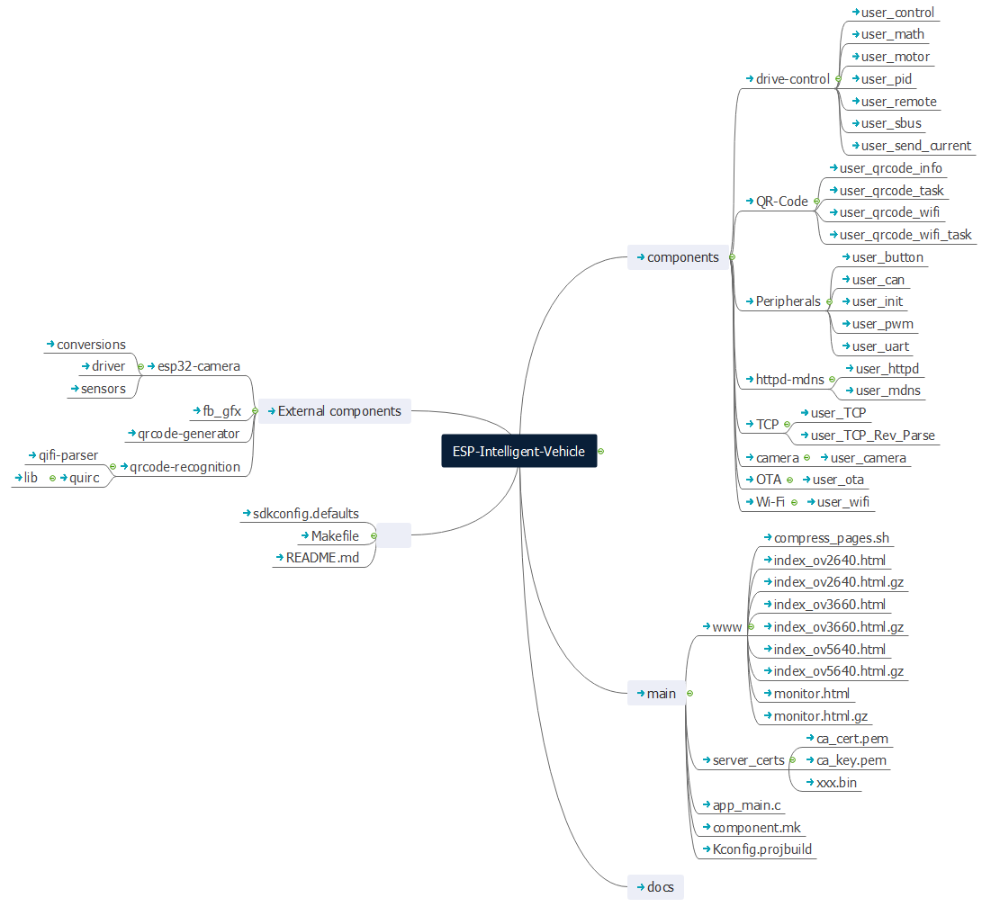

# 快速入门

## 项目简介

### ESP-Intelligent-Vehicle：ESP32 WIFI 智能小车

ESP-Intelligent-Vehicle 是乐鑫推出的基于 ESP32 开发的wifi智能小车示例项目，内含产品开发的完整步骤、最佳做法，可实现摄像头扫描二维码配网、扫描二维码信息解析并上报、通过遥控器sbus协议或局域网内TCP通信对小车的移动控制、局域网内通过TCP通信发送命令控制小车进行物料搬运、小车定点寻路、视频同步、OTA等功能。本项目功能扩展方便，可用于教育领域。


本项目中的智能小车有以下功能：

- 板载自动下载电路
- 支持解析二维码信息
- 支持扫描二维码配网
- 支持定点寻路
- 支持遥控器（sbus协议）控制
- 支持PC远程控制
- 支持扫描二维码上报位置
- 支持视频同步
- 支持 OTA 升级
- 支持物料搬运


## 硬件介绍

**ESP-Intelligent-Vehicle 使用了ESP-WROVER-KIT-V4.1开发板，搭载OV2640 Camera模块**

**小车驱动部分由CAN通信进行控制的电机连接全向轮组成**

**物料搬运部分由舵机连接组成**

|序号| 模块名 | 主要元器件 | 功能 |
|:-:|:-:|:-:|:-:|
|1| 主控制板 - **ESP32** | ESP32-WROVER-B |提供 I2C SPI GPIO 扩展接口  |
|2|反相器模块 | 74HC04D | 反相接收机信号 |
|3| CAN收发器模块 | TJA1050 | Tx、Rx电平转为CAN协议的差分信号 |

## ESP-IDF 简介

ESP-IDF 是乐鑫为 ESP32/ESP32-S2 提供的物联网开发框架。

* ESP-IDF 包含一系列库及头文件，提供了基于 ESP32/ESP32-S2 构建软件项目所需的核心组件。
* ESP-IDF 还提供了开发和量产过程中最常用的工具及功能，例如：构建、烧录、调试和测量等。

详情可查阅：[ESP-IDF 编程指南](https://docs.espressif.com/projects/esp-idf/zh_CN/latest/esp32s2/get-started/index.html)。


## 获取项目源代码

**测试版本代码，目前放在 Gitlab 仓库，可使用 git 工具获取：**

```
git clone ssh://git@glab.espressif.cn:8266/intern-porjects/esp-intelligent-vehicle.git
```

**项目软件主要由硬件驱动和依赖库组成：**

* 硬件驱动按照硬件接口进行划分，包括 CAN 设备、PWM 设备、UART 设备等。
* 依赖库包括 ESP-IDF 提供的默认组件。

**代码文件结构如下所示：**

```c
├── External components               | 外部项目组件目录
│   ├── esp32-camera                  | camera组件
│   │   ├── conversions               | 帧格式转换组件 
│   │   ├── driver                    | camera驱动组件 
│   │   └── sensors                   | 图像传感器组件
│   ├── fb_gfx                        | 
│   ├──  qrcode-generator             | QR码生成器库
│   ├──  qrcode-recognition           | QR码解析
│   │   ├── qifi-parser               | Wi-Fi二维码解析代码 
│   │   └── quirc                     | QR码提取解析库
├── components                        | 项目组件目录
│   ├── user_config                   | 系统 task 配置
│   │   └── include
│   ├── drive-control                 | 底盘驱动目录
│   │   ├── user_control              | 遥控器控制底盘运动
│   │   ├── user_math                 | 基本数学函数
│   │   ├── user_motor                | 电机驱动及接收反馈
│   │   ├── user_pid                  | PID反馈调节
│   │   ├── user_remote               | 转换遥控器通道值
│   │   ├── user_sbus                 | 解码sbus协议
│   │   └── user_send_current         | 驱动电机
│   ├──  QR-Code                      | 二维码目录
│   │   ├── user_qrcode_info          | 解析二维码数据命令
│   │   ├── user_qrcode_task          | 解析二维码数据任务
│   │   ├── user_qrcode_wifi          |  解析Wi-Fi二维码
│   │   └── user_qrcode_wifi_task     |  解析Wi-Fi二维码任务
│   ├──  Peripherals                  | 外设目录
│   │   ├── user_init                 | 外设初始化
│   │   ├── user_button               | 按键配置，用于OTA和erase-flash
│   │   ├── user_can                  |  CAN驱动，用于驱动电机
│   │   ├── user_pwm                  |  PWM配置，用于驱动舵机
│   │   └── user_uart                 |  UART配置，用于接收遥控器数据
│   ├── httpd-mdns                    | 
│   │   ├── user_httpd                | 
│   │   └── user_mdns                 | 
│   ├── TCP| TCP目录
│   │   ├── user_TCP                  | TCP初始化、接收数据、发送数据
│   │   └── user_TCP_Rev_Parse        | 解析命令并执行操作
│   ├── camera                        | 摄像头目录
│   │   └── user_camera               | 摄像头初始化，用于扫描二维码和视频监控
│   ├── OTA| OTA目录
│   │   └── user_ota                  | OTA任务配置，短按按键开启OTA
│   └── Wi-Fi| Wi-Fi目录
│          └── user_wifi              | Wi-Fi驱动，用于通信
├── main
│   ├── www                           | 视频监控html
│   ├── server_certs                  | 放置自签名证书、密钥和固件
│   │   ├── ca_cert.pem               | 证书
│   │   ├── ca_key.pem                | 密钥
│   │   └── xxxx.bin                  | 将要通过OTA升级的固件
│   ├── app_main                      | 入口函数
│   └── Kconfig.projbuild             | 定义组件配置信息的选项规则
├── Makefile                          | 工具函数
├── README.md                         | 项目说明
└── sdkconfig.defaults                | 默认参数
```

**详情可查阅**：[esp-intelligent-vehicle_file_structure](../../_static/pdf/ESP-Intelligent-Vehicle.pdf)。

## 源代码风格

**使用枚举类型计数**

以下枚举类型成员 SensorImplementation\_COUNT，始终可以代表枚举类型中成员的个数。巧妙利用了枚举类型第一个成员默认为 0 的特点。

```c
typedef enum {
    QR_STATE_MIN = 0,
    QR_SCANNING,
    QR_QIFI_STRING_PARSE_OK,
    QR_QIFI_STRING_PARSE_FAIL,
} QR_code_state_t;
```

**紧凑的数据类型**

```c
typedef struct {
    uint8_t name;
    uint32_t self_x;
    uint32_t self_y;
    uint32_t self_z;
    struct {
        char E_direction;
        uint8_t E_target_name;
        uint32_t E_distance;

        char S_direction;
        uint8_t S_target_name;
        uint32_t S_distance;

        char W_direction;
        uint8_t W_target_name;
        uint32_t W_distance;

        char N_direction;
        uint8_t N_target_name;
        uint32_t N_distance;
    } target_t;
} __attribute__((QR_Code_Info_t));
```

**attribute** \(\(packed\)\) 的作用是：使编译器取消结构在编译过程中的优化对齐，而按照实际占用字节数进行对齐。这是 GCC 特有的语法，与操作系统无关，与编译器有关。GCC 和 VC（在 Windows 下）的编译器为非紧凑模式，TC 的编译器为紧凑模式。例如：

```text
在 TC 下：struct my{ char ch; int a;} sizeof(int)=2;sizeof(my)=3;（紧凑模式）
在 GCC 下：struct my{ char ch; int a;} sizeof(int)=4;sizeof(my)=8;（非紧凑模式）
在 GCC 下：struct my{ char ch; int a;}__attrubte__ ((packed)) sizeof(int)=4;sizeof(my)=5
```


