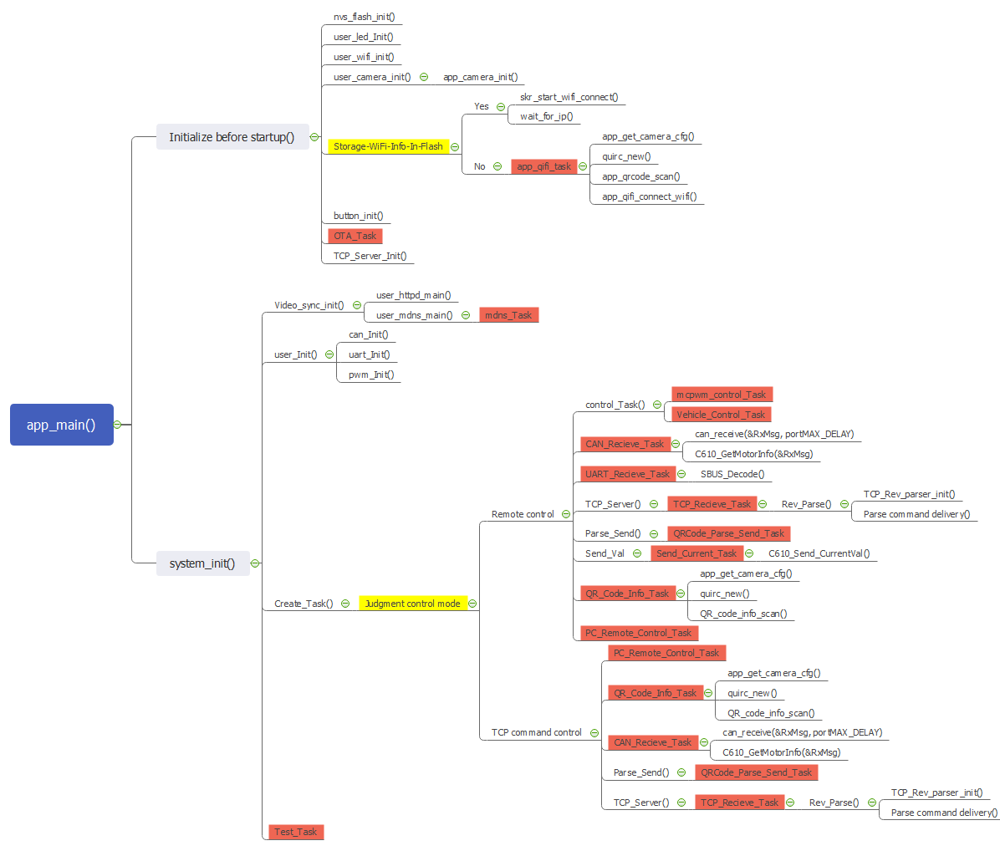
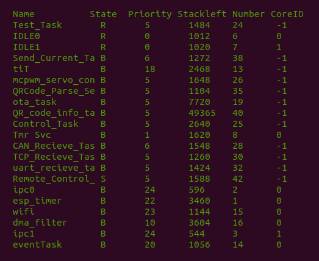
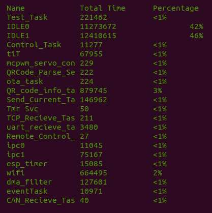
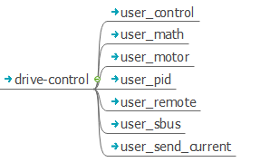

# 智能小车系统

## 系统启动流程



查阅源文件：[start_from_app_main](../../_static/pdf/start_from_app_main.pdf)。

## 系统任务管理

### 系统任务简介

系统正常运行时，将启动以下 TASK。





其中，

* Name：TASK 名称；
* State：TASK状态    已阻止（'B'），就绪（'R'），已删除（'D'）或已暂停（'S'）
* Priority：TASK 优先级。
* StackLeft：TASK剩余堆栈空间；
* Number：TASK序号
* CoreID：TASK所在核
* Total Time：TASK总执行时间绝对值
* Percentage：CPU 占用率；

TASK 具体描述如下：

* Test_Task：测试任务（仅测试用），检测任务运行状态的栈使用情况
* Control_Task：根据遥控器各通道值来控制小车运动
* mcpwm_servo_control：货物搬运控制
* QRCode_Parse_Send_Task：将二维码内容格式化发送至TCP Client
* ota_task：检测到按键短按之后进行OTA更新
* QR_code_info_task：扫描二维码并解析二维码内容
* Send_Current_Task：通过CAN总线向电机发送电流
* TCP_Recieve_Task：TCP包接收并将命令进行解析
* uart_recieve_task：串口接受遥控器数据并解析
* Remote_Control_Task：根据不同TCP Client的命令来做出相应的控制动作
* CAN_Recieve_Task：接受CAN总线上的电机反馈消息并解析
* mdns_cam：视频网页同步
* IDLE0：空闲任务0 主要处理 `task watchdog` 和芯片睡眠 (`sleep`) 功能
* IDLE1：空闲任务1 主要处理 `task watchdog` 和芯片睡眠 (`sleep`) 功能
* tiT： `LWIP` 核心 task。负责整个 `TCP/IP` 协议栈的维护
* Tmr Svc： `FreeRTOS` 内部创建的 `timer task`。当前主要处理所有软件定时器功能
* ipc0：
* ipc1
* esp_timer
* wifi
* dma_filter
* eventTask

### 任务堆栈空间配置

用户可以在 `components/config/include/config.h` 中直接修改空间大小，也可以在 `menucfg` 中修改 `BASE_STACK_SIZE` 大小。

```c
#define configBASE_STACK_SIZE CONFIG_BASE_STACK_SIZE
//Task stack sizes
#define SLOW_FREQUENCY_TASK_STACKSIZE       (500)
#define FAST_FREQUENCY_TASK_STACKSIZE       (500)
#define OTA_TASK_STACKSIZE                (8 * configBASE_STACK_SIZE)
#define CREAT_TASK_STACKSIZE              (4 * configBASE_STACK_SIZE)
#define TEST_TASK_STACKSIZE                (2* configBASE_STACK_SIZE)
#define CONTROL_TASK_STACKSIZE            (3 * configBASE_STACK_SIZE)
#define CAN_RECIEVE_TASK_STACKSIZE          (2*configBASE_STACK_SIZE)
#define TCP_RECIEVE_TASK_STACKSIZE        (2 * configBASE_STACK_SIZE)
#define QRCODE_PARSE_SEND_TASK_STACKSIZE  (2 * configBASE_STACK_SIZE)
#define SEND_CURRENT_TASK_STACKSIZE       (3 * configBASE_STACK_SIZE)
#define MCPWM_SERVO_CONTROL_TASK_STACKSIZE(2 * configBASE_STACK_SIZE)
#define UART_RECIEVE_TASK_STACKSIZE      (3 * configBASE_STACK_SIZE)
#define QR_CODE_INFO_TASK_STACKSIZE     (64 * configBASE_STACK_SIZE)
#define REMOTE_CONTROL_TASK_STACKSIZE    (2 * configBASE_STACK_SIZE)
```

### 任务优先级配置

系统 TASK 优先级可以在 `components/config/include/config.h` 中进行配置。由于 `ESP32` 具有双核优势，相比 `ESP32-S2` 计算资源更加富余，可将高耗时的 `KALMAN_TASK` 优先级调高。

```c
// Task priorities. Higher number higher priority
#define SLOW_FREQUENCY_TASK_PRI   6
#define FAST_FREQUENCY_TASK_PRI   6
#define OTA_TASK_PRI              6
#define CREAT_TASK_PRI            5
#define TEST_TASK_PRI             5
#define CONTROL_TASK_PRI          5
#define CAN_RECIEVE_TASK_PRI      6
#define TCP_RECIEVE_TASK_PRI      5
#define QRCODE_PARSE_SEND_TASK_PRI   5
#define SEND_CURRENT_TASK_PRI        6
#define MCPWM_SERVO_CONTROL_TASK_PRI 5
#define UART_RECIEVE_TASK_PRI        5
#define QR_CODE_INFO_TASK_PRI        5
#define REMOTE_CONTROL_TASK_PRI      5
```


## 舵机驱动

舵机其实就是较为简单的伺服电机，其内部具有一种位置伺服的驱动器，适用于那些需要角度不断变化并可以保持的控制系统。

故本项目将使用MCPWM模块来控制舵机

#### 引脚分配

```c
    mcpwm_gpio_init(MCPWM_UNIT_0, MCPWM0B, 2);
    mcpwm_gpio_init(MCPWM_UNIT_0, MCPWM0A, 12);
```

GPIO_2和GPIO_12被分配为伺服电机的MCPWM信号

#### 连线


GPIO_2和GPIO_12分别连接至一号舵机和二号舵机的信号线（即图上的黄色线），另外再通过5v电源给两只舵机进行供电（红色连接VCC，棕色连接GND）。

#### 初始化MCPWM

```c
    mcpwm_config_t pwm_config;
    pwm_config.frequency = 50; //frequency = 50Hz, i.e. for every servo motor time period should be 20ms
    pwm_config.cmpr_a = 0;     //duty cycle of PWMxA = 0
    pwm_config.cmpr_b = 0;     //duty cycle of PWMxb = 0
    pwm_config.counter_mode = MCPWM_UP_COUNTER;
    pwm_config.duty_mode = MCPWM_DUTY_MODE_0;
    mcpwm_init(MCPWM_UNIT_0, MCPWM_TIMER_0, &pwm_config); //Configure PWM0A & PWM0B with above settings

```

在PWM初始化的时候需要设置MCPWM定时器的频率（通常为50 Hz）、占空比、要使用的MCPWM通道，并将该通道与计时器之一绑定

>本项目中使用到的舵机属于180度舵机，即控制他转动的占空比在500us(0)到2500us(180),因为实际使用中只使用到90度，故将在500us(0)与1500us(90)之间进行调节占空比

#### 货物搬运动作执行

- 通过val变量获取遥控器上二位开关的状态，根据不同状态执行拿起和放下的动作。

```c
while (1){
    val = (uint16_t)Remote_PulseToSwitch_Two(Remote_GetVA());
    if (val != flag){				//判断二位开关状态是否改变，改变即向下进行，不改变任务被阻塞
        if (val == Remote_0){
            Put_down_Action();
            flag = 0x00;
        }else if (val == Remote_1){
            Pick_up_Action();
            flag = 0x01;
        }
    }
    vTaskDelay(1000 / portTICK_RATE_MS);
}
```

- 拿起和放下的动作流程又包含不同的动作步骤，通过switch case以及一个step变量进行动作的连贯操作。

```c
    int step = 1;
    while(step){
        switch (step)
        {
        case 1:
            Pick_up_Action1();
            step = 2;
            break;

        case 2:
            Pick_up_Action2();
            step = 3;
            break;

        case 3:
            Pick_up_Action3();
            step = 0;
            break;

        default:
            step = 1;
            break;
        }
        vTaskDelay(1000 / portTICK_RATE_MS);
    }
```

当然，当接收到TCP Client发过来的命令`pickup:`、`putdown:`时，TCP命令控制任务也会调用上述的货物搬运动作进行执行。

PWM控制舵机动作具体代码请参考`components\Peripherals\user_pwm.c`


## UART驱动

项目中主要通过UART来接收遥控器数据

#### 接线

将接收机的SBUS信号线通过反相器连接在GPIO_13

#### UART初始化

```c
     const uart_config_t uart_config = {
        .baud_rate = 100000,
        .data_bits = UART_DATA_8_BITS,
        .parity = UART_PARITY_EVEN,
        .stop_bits = UART_STOP_BITS_2,
        .flow_ctrl = UART_HW_FLOWCTRL_DISABLE,
    };
     //Install UART driver, and get the queue.
    uart_param_config(UART_NUM_1, &uart_config);
    uart_set_pin(UART_NUM_1, TXD_PIN, RXD_PIN, UART_PIN_NO_CHANGE, UART_PIN_NO_CHANGE);
    uart_driver_install(UART_NUM_1, RX_BUF_SIZE * 4, 0, 20, &uart1_queue, 0);
```

配置UART波特率为100000，八位数据位，偶校验，两位停止位，无硬件流控

#### 接受数据

在uart_recieve_task中，通过调用uart_read_bytes()接收一个字节数据，然后再通过switch case进行SBUS协议的起始字节匹配，当起始字节和结束字节均匹配成功时，中间接收到的数据根据SBUS协议进行Decode解码后赋值给代表不同通道的结构体。

```c
for(;;) {
    uint8_t flag = 1;
    xQueueReceive(uart1_queue, (void * )&event, (portTickType)portMAX_DELAY);
    bzero(dtmp, 1024);
    switch(event.type) {
        case UART_DATA:
            read_len = uart_read_bytes(UART_NUM_1, dtmp, event.size, portMAX_DELAY);
            dtmp[read_len] = 0;
            const uint8_t *d = dtmp;
            static uint8_t RxState = 0, RxDataIndex = 0;
            while(flag){
                switch(RxState){
                    case 0:				//The start mark has not been detected yet, start to match the start mark
                        if(*d == 0x0F)
                        {
                            RxState++;
                            SBUS_MsgPack[0] = *d;
                            RxDataIndex = 1;
                        }
                        else
                            RxState = 0;
                        break;
                    case 1:					//Start mark matches, start to receive raw data
                        SBUS_MsgPack[RxDataIndex] = *d;
                        RxDataIndex++;
                        if(RxDataIndex >= 23)
                        {
                            RxDataIndex = 0;
                            RxState++;
                        }
                        break;
                    case 2:					//The data has been received, the first byte of the start matching end flag
                            SBUS_MsgPack[23] = *d;
                            RxState++;
                        break;
                    case 3:					//The first byte of the end flag is matched, and the second byte of the start matching end flag
                        if(*d == 0x00)
                        {
                            UpdateRemoteInfo((void*)&SBUS_MsgPack[0]);
                            SBUS_MsgPack[24] = 0x00;
                            RemoteUpdated = 1;
                        }
                        RxState = 0;
                        flag = 0;
                        break;
                    default:
                        RxState = 0;
                }
                d++;
            }
            break;

        default:
            break;
        }
}
```

```c
typedef struct Remote_t
{
	int16_t LX;
	int16_t LY;
	int16_t RX;
	int16_t RY;
	int16_t T1;
	int16_t S1;
	uint16_t VA;
	int16_t S2;
	int16_t T2;
} Remote_t;
```


## CAN驱动

项目中主要通过CAN总线与电子调速器通信，从而通过电流值控制电机转速，同时开发板也可以通过CAN总线接收到电机发送过来的数据帧，包含电机实时转速、电流、单圈绝对位置信息，可以通过这些反馈信息对电机进行PID速度环、位置环控制。

#### 接线


开发板的GPIO_14、GPIO_15分别配置为CAN控制器的Tx、Rx，连接到外部CAN收发器的Tx、Rx。

本项目用到的动力系统为RoboMaster M2006电机（以下简称M2006电机）和C610无刷电机调速器（C610电调）

##### M2006电机供电

24V 6s锂电池通过电调中心板分出四路24v电压供给四个电机

##### CAN总线通信

- 四个电调上引出的CAN_H、CAN_L以及外部CAN收发器的CAN_H、CAN_L分别连接至电调中心板上进行通信

- 每个电调和开发板都相当于CAN网络上的一个节点，都可以进行收发数据帧
- 每个电调都具有提前标定好且唯一的ID，用于接收开发板发送的控制指令来进行控制电流输出

>开发板通过向CAN网络上发送数据帧来控制电机转速
>
>电调通过CAN网络发送电机反馈信息给开发板

#### CAN初始化

```c
can_general_config_t g_config = CAN_GENERAL_CONFIG_DEFAULT(GPIO_NUM_14, GPIO_NUM_15,CAN_MODE_NORMAL);
can_timing_config_t t_config = CAN_TIMING_CONFIG_1MBITS();
can_filter_config_t f_config = CAN_FILTER_CONFIG_ACCEPT_ALL();

//Install can driver
can_driver_install(&g_config, &t_config, &f_config);
can_start() ;
```

配置CAN控制器为正常模式，CAN总线比特率为1Mbps

#### CAN通信协议

1、电调接收报文格式

用于向电调发送控制指令控制电调的电流输出，两个标识符（0x200和0x1FF）各自对应控制4个ID的电调。控制转矩电流值范围-10000~0~10000，对应电调输出的转矩电流范围-10~0~10A

标识符：0x200        帧格式：DATA

帧类型：标准帧        DLC：8字节

| 数据域  | 内容            | 电调ID |
| ------- | --------------- | ------ |
| DATA[0] | 控制电流值高8位 | 1      |
| DATA[1] | 控制电流值低8位 | 1      |
| DATA[2] | 控制电流值高8位 | 2      |
| DATA[3] | 控制电流值低8位 | 2      |
| DATA[4] | 控制电流值高8位 | 3      |
| DATA[5] | 控制电流值低8位 | 3      |
| DATA[6] | 控制电流值高8位 | 4      |
| DATA[7] | 控制电流值低8位 | 4      |

标识符：0x1FF        帧格式：DATA

帧类型：标准帧        DLC：8字节

| 数据域  | 内容            | 电调ID |
| ------- | --------------- | ------ |
| DATA[0] | 控制电流值高8位 | 5      |
| DATA[1] | 控制电流值低8位 | 5      |
| DATA[2] | 控制电流值高8位 | 6      |
| DATA[3] | 控制电流值低8位 | 6      |
| DATA[4] | 控制电流值高8位 | 7      |
| DATA[5] | 控制电流值低8位 | 7      |
| DATA[6] | 控制电流值高8位 | 8      |
| DATA[7] | 控制电流值低8位 | 8      |

```c
void C610_SendCurrentVal(int16_t I1, int16_t I2, int16_t I3, int16_t I4)
{
	int16_t Current_1 = I1;
	int16_t Current_2 = I2;
	int16_t Current_3 = I3;
	int16_t Current_4 = I4;
	can_message_t message;
	message.flags = CAN_MSG_FLAG_NONE;
	message.identifier = 0x200;
  	message.data_length_code = 0x08;
    message.data[0] = (Current_1 >> 8);
    message.data[1] = Current_1;
    message.data[2] = (Current_2 >> 8);
    message.data[3] = Current_2;
    message.data[4] = (Current_3 >> 8);
    message.data[5] = Current_3;
    message.data[6] = (Current_4 >> 8);
    message.data[7] = Current_4;
	can_transmit(&message, portMAX_DELAY);
}
```


2、电调反馈报文格式

电调向总线上发送的反馈数据

标识符：0x200 + 电调ID（如：ID为1，该标识符为0x201）

帧格式：DATA

帧类型：标准帧

DLC：8字节

| 数据域  | 内容              |
| ------- | ----------------- |
| DATA[0] | 转子机械角度高8位 |
| DATA[1] | 转子机械角度低8位 |
| DATA[2] | 转子转速高8位     |
| DATA[3] | 转子转速低8位     |
| DATA[4] | 实际输出转矩高8位 |
| DATA[5] | 实际输出转矩低8位 |
| DATA[6] | NULL              |
| DATA[7] | NULL              |

发送频率：1KHz

转子机械角度值范围：0 ~ 8191（对应转子机械角度为0 ~ 360°）

转子转速值的单位为：rpm

```c
void C610_GetMotorInfo(can_message_t* RxMsg)
{
	uint8_t ESC_Id = RxMsg ->identifier - ESC_BaseID;
	uint16_t LastPulse;
	int16_t DeltaPulse;
	if(ValueInRange_u(ESC_Id, 0, 3)){
		LastPulse = MotorInfo[ESC_Id].AnglePulse;
		MotorInfo[ESC_Id].AnglePulse = (uint16_t)(RxMsg -> data[0] << 8 | RxMsg -> data[1]);
		MotorInfo[ESC_Id].Velocity	 = (int16_t)(RxMsg -> data[2] << 8 | RxMsg -> data[3]);
		MotorInfo[ESC_Id].Current	 = (int16_t)(RxMsg -> data[4] << 8 | RxMsg -> data[5]);
		DeltaPulse = MotorInfo[ESC_Id].AnglePulse - LastPulse;
		if(DeltaPulse > 4095)
			DeltaPulse -= 8192;
		else if(DeltaPulse < -4096)
			DeltaPulse += 8192;
		MotorInfo[ESC_Id].Position += DeltaPulse;
	}
}
```

通过CAN总线接收到电调发送的数据帧之后通过C610_GetMotorInfo() API解析反馈信息并保存在结构体中

```c
typedef struct MotoInfo_t
{
	uint16_t	AnglePulse;
	int16_t		Velocity;
	int16_t		Current;
	int32_t		Position;
}MotoInfo_t;
```

  

## LED驱动

本项目中所用到的LED主要为了指示wifi是否连接成功以及TCP是否连接成功

当系统开始运行时，如果Flash中存有已连接Wi-Fi的信息，开发板会尝试连接该Wi-Fi，同时**LED_GREEN熄灭**

如果系统开始运行后，**LED_GREEN慢闪**，说明摄像头开始启动，正在不断捕获二维码图像，此时用户需将Wi-Fi二维码放置在摄像头10 ~ 20cm前，摄像头识别到二维码并解析后尝试连接该Wi-Fi

待开发板连接到Wi-Fi之后，**LED_GREEN快闪**，此时用户需启动TCP Client来进行TCP连接，可输入如下命令

```
nc 192.168.0.162 3333
```

IP地址为开发板连接Wi-Fi之后被分配到的IP，端口号默认为3333，端口号可以通过`menuconfig->Intelligent Vehicle Configuration->TCP->port`进行修改


## Button

ESP-WROVER-KIT-V4.1开发板上有两个实体按键，其中EN作为复位开发板按键使用，通过程序可配置Boot按键功能

#### 初始化

```c
static void button_press_3sec_cb(void *arg)
{
    ESP_LOGW("Project", "Restore factory settings");
    nvs_flash_erase();
    esp_restart();
}

static void button_press_cb(void *arg)
{
    ESP_LOGW("Project", "Start firmware upgrade");
    OTA_flag = 1;
}

static void configure_push_button(int gpio_num, void (*btn_cb)(void *))
{
    button_handle_t btn_handle = iot_button_create(gpio_num, 0);

    if (btn_handle) {
        iot_button_set_evt_cb(btn_handle, BUTTON_CB_TAP, button_press_cb, NULL);
        iot_button_add_on_press_cb(btn_handle, 3, button_press_3sec_cb, NULL);
    }
}
```

Button在TCP连接之前进行初始化，短按Boot按钮可以进行OTA升级，长按3秒Boot按钮可以擦除Flash，擦除Flash之后，系统下次重启需要重新扫描二维码进行配网。

具体有关OTA方面的讲解，请参考[固件升级](Firmware upgrade.md)


## 视频同步

在`menuconfig->Intelligent Vehicle Configuration->Example Configuration->video sync`选择`1`即可打开视频同步功能

在固件开始运行后，位于同一个局域网之内的PC端打开浏览器并将其指向`http://[ip-of-esp32]/`，通过网页中的`Get Still`和`Get Stream`两个按钮来捕获图像或者视频流。


```c
#include "esp_camera.h"
#include "esp_http_server.h"
#include "esp_timer.h"

#define PART_BOUNDARY "123456789000000000000987654321"
static const char* _STREAM_CONTENT_TYPE = "multipart/x-mixed-replace;boundary=" PART_BOUNDARY;
static const char* _STREAM_BOUNDARY = "\r\n--" PART_BOUNDARY "\r\n";
static const char* _STREAM_PART = "Content-Type: image/jpeg\r\nContent-Length: %u\r\n\r\n";

esp_err_t jpg_stream_httpd_handler(httpd_req_t *req){
    camera_fb_t * fb = NULL;
    esp_err_t res = ESP_OK;
    size_t _jpg_buf_len;
    uint8_t * _jpg_buf;
    char * part_buf[64];
    static int64_t last_frame = 0;
    if(!last_frame) {
        last_frame = esp_timer_get_time();
    }

    res = httpd_resp_set_type(req, _STREAM_CONTENT_TYPE);
    if(res != ESP_OK){
        return res;
    }

    while(true){
        fb = esp_camera_fb_get();
        if (!fb) {
            ESP_LOGE(TAG, "Camera capture failed");
            res = ESP_FAIL;
            break;
        }
        if(fb->format != PIXFORMAT_JPEG){
            bool jpeg_converted = frame2jpg(fb, 80, &_jpg_buf, &_jpg_buf_len);
            if(!jpeg_converted){
                ESP_LOGE(TAG, "JPEG compression failed");
                esp_camera_fb_return(fb);
                res = ESP_FAIL;
            }
        } else {
            _jpg_buf_len = fb->len;
            _jpg_buf = fb->buf;
        }

        if(res == ESP_OK){
            res = httpd_resp_send_chunk(req, _STREAM_BOUNDARY, strlen(_STREAM_BOUNDARY));
        }
        if(res == ESP_OK){
            size_t hlen = snprintf((char *)part_buf, 64, _STREAM_PART, _jpg_buf_len);
            res = httpd_resp_send_chunk(req, (const char *)part_buf, hlen);
        }
        if(res == ESP_OK){
            res = httpd_resp_send_chunk(req, (const char *)_jpg_buf, _jpg_buf_len);
        }
        if(fb->format != PIXFORMAT_JPEG){
            free(_jpg_buf);
        }
        esp_camera_fb_return(fb);
        if(res != ESP_OK){
            break;
        }
        int64_t fr_end = esp_timer_get_time();
        int64_t frame_time = fr_end - last_frame;
        last_frame = fr_end;
        frame_time /= 1000;
        ESP_LOGI(TAG, "MJPG: %uKB %ums (%.1ffps)",
            (uint32_t)(_jpg_buf_len/1024),
            (uint32_t)frame_time, 1000.0 / (uint32_t)frame_time);
    }

    last_frame = 0;
    return res;
}
BMP HTTP Capture
#include "esp_camera.h"
#include "esp_http_server.h"
#include "esp_timer.h"

esp_err_t bmp_httpd_handler(httpd_req_t *req){
    camera_fb_t * fb = NULL;
    esp_err_t res = ESP_OK;
    int64_t fr_start = esp_timer_get_time();

    fb = esp_camera_fb_get();
    if (!fb) {
        ESP_LOGE(TAG, "Camera capture failed");
        httpd_resp_send_500(req);
        return ESP_FAIL;
    }

    uint8_t * buf = NULL;
    size_t buf_len = 0;
    bool converted = frame2bmp(fb, &buf, &buf_len);
    esp_camera_fb_return(fb);
    if(!converted){
        ESP_LOGE(TAG, "BMP conversion failed");
        httpd_resp_send_500(req);
        return ESP_FAIL;
    }

    res = httpd_resp_set_type(req, "image/x-windows-bmp")
       || httpd_resp_set_hdr(req, "Content-Disposition", "inline; filename=capture.bmp")
       || httpd_resp_send(req, (const char *)buf, buf_len);
    free(buf);
    int64_t fr_end = esp_timer_get_time();
    ESP_LOGI(TAG, "BMP: %uKB %ums", (uint32_t)(buf_len/1024), (uint32_t)((fr_end - fr_start)/1000));
    return res;
}
```

具体代码实现请参考`components\httpd-mdns\user_httpd.c`和`components\httpd-mdns\user_mdns.c`


## 小车底盘驱动

小车底盘驱动代码，可以在 `components\drivers` 中查阅。该组件将驱动程序按照功能进行分类，包括 `user_control`、`user_motor`、`user_remote` 等。



系统默认选择使用PC端远程控制小车，不过也可以取消勾选`menuconfig`中`Intelligent Vehicle Configuration->Example Configuration->PC control operation mode`选项，使得用户可以通过遥控器控制小车移动。

遥控器控制小车任务不断判断此刻遥控器上三位开关以及二位开关的状态，根据遥控器上开关状态执行不同的操作


```c
	/*	Task function in each mode	*/
	switch((uint8_t)UnderpanMode)
	{
		/*Standby mode, ESC cuts off output, wheels can be turned manually*/
		case UnderpanMode_Standby:
			Vehicle_LostForce();
			break;
		
		/*remote mode*/
		case UnderpanMode_Remote:
			ESCMode = ESCMode_Velocity;
			Vehicle_RemoteTask();
			break;
		
		/*Test mode	*/
		case UnderpanMode_Test:
			ESCMode = ESCMode_Velocity;
            Test_Task();
			break;
	}
```

### 失力模式

三位开关第一档，设置每个电机对应电流为零，从而使小车失力，此模式下外力可以移动小车

### 遥控模式

三位开关第二档，该模式下通过获取遥控器中遥杆通道的值，经过比例换算成底盘要达到的x y方向的速度以及自旋速度，三者合成底盘的实际速度并解算出实际要输出给每个电机的电流值

```c
void UnderpanRemoteTask(void)
{
	/*
	 *	Ratio_S	 :The ratio coefficient of chassis speed and rocker value
	 *	Ratio_A	 :The proportional coefficient of the chassis angular velocity and the rocker value
	 */
	float Ratio_S = UnderpanConfig.MaxSpeed / 1000.0f;
	float Ratio_A = UnderpanConfig.MaxSpeed / 10000.0f;
	
	/*Convert channel valueֵ*/
	int16_t LX = Remote_PulseToVal(Remote_GetLY());
	int16_t RX = Remote_PulseToVal(Remote_GetRX());
	int16_t RY = Remote_PulseToVal(Remote_GetRY());
	
	/*Velocity component*/
	float Vx, Vy, Va;
    
    Vx = RX * Ratio_S;
	Vy = RY * Ratio_S;
	Va = LX * Ratio_A;
    
	/*Speed softening*/
	if(UnderpanConfig.SpeedSoften == SpeedSoften_ON){
		Underpan.Speed_x = FlexibelValue(Vx, Underpan.Speed_x, 5000.0f / 200);
		Underpan.Speed_y = FlexibelValue(Vy, Underpan.Speed_y, 5000.0f / 200);
		Underpan.Speed_a = FlexibelValue(Va, Underpan.Speed_a, 5000.0f / 200);
	}else{
		Underpan.Speed_x = Vx;
		Underpan.Speed_y = Vy;
		Underpan.Speed_a = Va;
	}
	
	/*Calculate wheel speed*/
    Underpan.Speed_Wheel_1 = -Underpan.Speed_x - Underpan.Speed_y - UnderpanConfig.OmegaRatio * Underpan.Speed_a;
    Underpan.Speed_Wheel_2 = -Underpan.Speed_x + Underpan.Speed_y - UnderpanConfig.OmegaRatio * Underpan.Speed_a;
    Underpan.Speed_Wheel_3 = +Underpan.Speed_x + Underpan.Speed_y - UnderpanConfig.OmegaRatio * Underpan.Speed_a;
    Underpan.Speed_Wheel_4 = +Underpan.Speed_x - Underpan.Speed_y - UnderpanConfig.OmegaRatio * Underpan.Speed_a;
}
```

### 测试模式

三位开关第三档，测试遥控器控制模式用


## 摄像头驱动

ESP-Intelligent-Vehicle进行二维码识别以及视频同步均要用到摄像头的组件，所用到的摄像头组件来源于[esp32-camera](https://github.com/espressif/esp32-camera)

其提供了适用于OV2640，OV3660，OV5640和OV7725图像传感器的ESP32驱动程序。同时，它还提供了一些工具，可以将其帧数据转换为更常见的BMP和JPEG格式。


